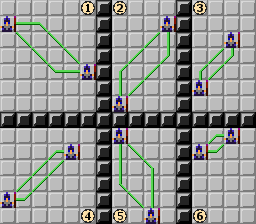
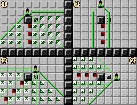
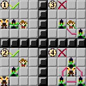
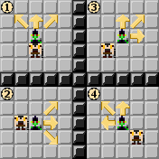
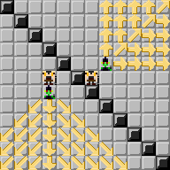
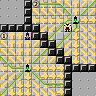

# Combat 

<!---
## Combat Fundamentals
## The Combat Map
### Distances
### Lines, Bursts, Blasts
### Line of Sight and Cover
### Light and Concealment
### Flanking

## Combat Sequence
### Escalation

## Resource Management
### At-Will, Encounter and Daily powers
### Action Points
### Damage, Incapacitation and Healing

## Actions
### Reactions

## Movement

## Attacking
### Range and Targeting
### Hit Roll
### Hit Modifiers
#### Critical Hits
### Damage Roll
#### Miss Damage
### Combat Conditions
### Forced Movement

## Combat Maneuvers
###Standard Maneuvers
###Improvised Maneuvers
-->
In this chapter we provide the rules for resolving a combat encounter.

## Combat Fundamentals

In Square Fireballs, a combat encounter represents a short, violent conflict between an adventuring party of Player Characters and a group of Monsters controlled by the Game Master. 

<div class="tip">**Tip**:Note that we use **Monsters** as shorthand for "bad guys", and it is perfectly possible to have a Monster team composed of non-monstruous mundane characters like human bandits or wolves. Or they can also be, you know, many-eyed tentacled abominations.</div>

In combat, each character (whether a Player Character or a Monster) takes **turns** to carry out **actions** such as moving, attacking enemies, or healing or assisting allies. Some actions succeed automatically, whereas others require the character to make a successful die roll. For example, movement through normal terrain is resolved automatically, with the player stating the character's movement path and changing the character's position accordingly. On the other hand, attacking requires the character to roll against the enemy's defense to determine if the attack hits, and then rolling again to determine the damage dealt by the attack.

<div class="tip">**Tip**: Generally, to make a die roll in the game a player rolls a 20-sided die (aka. d20), adds the appropriate bonus from their Character Sheet, plus any modifiers that apply, and tries to beat a target number, like a Check Difficulty or an enemy defense stat. Another common type of die roll is the damage roll, which is made after hitting with an attack. In a damage roll, the player rolls several dice of a type determined by the attack, adds a damage bonus and uses the total as the amount of inflicted damage.</div>

The goal of a combat encounter is incapacitate all enemy characters, typically by inflicting enough damage to reduce them below 0 Hit Points. A combat can also end when either the monsters or the Player Characters decide to flee.


## The Combat Map


### Distances

The following figure illustrates how distances work. The number in each square represent the distance between the Wizard and that square.


This figure shows some specific examples of squares that are 1,2,3,4, and 5 units away from the Wizard


### Lines

Due to the way that distances are defined in our maps, certain geometrical elements like lines are not as straightforward as one would expect. In the game map, a Line is:

- one of the shortest paths between two points (note that there can be several paths that meet this requirement!)
- composed of up to two straight segments: one in the horizontal or vertical direction, and another in a diagonal direction. 

For any two points in the map, there will be one or two Lines that meet this definition.

This figure shows the simplest types of lines, composed of a single horizontal (1), vertical (2) or diagonal (3, 4) segment. Note that when two points can be joined by a single-segment Line, there will only be a single Line between these points.


This figure shows examples of two-segment lines. When two points can be joined by a two-segment line, there will always be two such lines between these points.



### Close and Area powers: Burst, Blast, Line

Area Burst


Range of Area Burst powers


Close Burst


TODO: Blast
TODO: Line


### Line of Sight and Cover

Basic cover


Basic cover examples with attacking characters


Cover for large creatures


Examples of cover for large creatures with attacking characters


Basic Line of Sight


Examples of Line of Sight with enemy characters


Examples of Line of Sight with walls and doors


Combining Line of Sight, Cover, Superior Cover



### Light and Concealment

Light


more light


Yet more light


### Flanking

Flanking basics



Flanking for large creatures


## Combat Sequence
### Escalation

## Resource Management
### At-Will, Encounter and Daily powers
### Action Points
### Damage, Incapacitation and Healing

## Actions
### Reactions

## Movement

## Attacking
### Range and Targeting
### Hit Roll
#### Hit Modifiers

Condition | Modifier
------------- | -------------
Defender grants Advantage to Attacker | +2
Defender has any Cover from Attacker | -2
Defender has Superior Cover from Attacker | -3
Defender has any Concealment from Attacker, attack is Melee or Ranged | -2
Defender has Superior Concealment from Attacker, attack is Melee or Ranged | -3
Attacker is Hindered | -2
Ranged attack at Long Range | -2

Note: Characters with Superior Cover also benefit from regular Cover, so attacks
against them will have a total modifier of -5. Likewise, Characters with 
Superior Concealment also benefit from regular Concealment, and attacks against
them have a total modifier of -5.

#### Critical Hits

### Damage Roll

#### Miss Damage

## Status Effects

Some powers or abilities can apply status effects on characters. A character afflicted by a status effect suffers penalties that depend on the type condition - see the table below for details.

Normally, the effect creating a status effect states its duration, which is often a combat turn, but can also last until the character saves against the effect, or even indefinitely, depending on the case. Certain status effects have special rules affecting their duration, typically in the form of conditions that end the effect prematurely.

It is possible for a character to be affected by multiple instances of a status effect. The penalties from instances of the same condition don't stack unless otherwise stated.

Some status effects care about the source of the effect. For example, in the case of the Taunt status effect, the Taunted character does not suffer penalties when attacking the Taunting character. If multiple instances of such an effect are affecting a character, it is important to keep track of the source of each one.

### Downgrading status effects

Some abilities allow a character to downgrade a status effect. To downgrade a status effect, check the Downgrade column in the status effect table: the character treats the status effect as if it was the downgraded one for the duration of the downgrade. Note that a downgrade may have a shorter duration than the status effect it applies to - in that case, the original effect applies again when the Downgrade ends.

If the downgrade for a status effect is listed as No Effect, the effect is completely ignored while Downgraded. Likewise, if it is listed as No Downgrade, the effect cannot be downgraded.

A status effect can only be downgraded once at any given time. Notably, this means that abilities that downgrade multiple types of status effect do not stack with themselves. As an example, consider a character with the ability to downgrade the Slowed and Immobilized status effects. If that character becomes Immobilized, the downgrade would allow them to act as if they were Slowed instead - but it wouldn't let them ignore the Slow.


### Standard Status Effects

Status | Downgrade | Effects
| - | - | --------
| Blinded | Dazzled | - Grants Advantage _(+2 to be hit)_<br />- Cannot Flank<br />- Treats other characters or objects as having Superior Concealment _(-5 to hit them)_.<br />- No line of sight to other characters or objects<br />- +1 DC to Perception Skill Checks.
| Charmed | No Effect | - Cannot attack enemies Charming the character.<br />- A character may be Charmed by multiple enemies at a time.<br />- Automatically ends if attacked by an enemy Charming the character.
| Dazed | Grants Advantage | - Grants Advantage _(+2 to be hit)_<br />- Cannot Flank<br />- Cannot use Opportunity or Immediate Actions<br />- Each turn, can use a Minor Action and either a Standard Action or a Move Action,
| Dazzled | No Effect | - Treats all enemies as having Concealment _(-2 to hit them)_ or, if already in Concealment, as having Superior Concealment _(an additional -3 to hit them)_.
| Dominated | Charmed | - Cannot take actions <br />- When damaged, can roll a Save to end this condition.  <br />- The dominating character can spend a move action to make the dominated character move its speed. _(This counts as forced movement)_ <br />- The dominating character can spend a standard action to make the dominated character use an at-will attack. _(This counts as a forced attack)_
| Flanked | No Downgrade | - Grants Advantage on Melee attacks _(+2 to be hit)_
| Grabbed | No Effect | Cannot move <br />-When grabbed, the character is pulled to a square adjacent to the grabbing character. <br />-The condition ends if at any time the grabbed character is not adjacent to the grabbing character.<br />-Grabbed character can use the Escape combat maneuver to end the condition. _(Move Action, roll save to end grab from one enemy)_<br />-If forced movement would cause the grabbed character and the grabbing character to no longer be adjacent, the grabbed character can roll a Save to end this condition. If the condition doesn’t end this way, the forced movement is negated<br />-A character may be Grabbed by multiple enemies at a time.
| Helpless | No Downgrade | - Grants Advantage _(+2 to be hit)_<br />-Melee Attacks against the character gain +10 Crit Range
| Hindered | No Effect | -2 Hit
| Immobilized | Slowed | Cannot move
| Taunted | No Effect | - -2 Hit on attacks that ignore the Taunt (see sidebar) <br />- A character may be Taunted by multiple enemies at a time.
| Petrified | Stunned | - Grants Advantage<br />- Cannot take actions<br />- Gains Resist (all).
| Prone | No Downgrade | Condition lasts indefinitely until the character stands up _(e.g. by spending a move action on the Stand Up maneuver)_ <br />-Cannot make any movement other than crawling (e.g. by having a Crawl Speed, or by using the Crawl combat maneuver: Move Action, crawl 1)<br />-Hindered (-2 Hit)<br />-Grants Advantage against melee attacks (+2 to be hit)<br />-Against non-melee attacks, gains Cover (-2 cover penalty to attack rolls) or, if already in Cover, gains Total Cover (an additional -3 cover penalty to attack rolls)
| Restrained | Grabbed | - Cannot move <br />- Ignores forced movement <br />- Grants Advantage (+2 to be hit) <br />- Hindered (-2 Hit)
| Slowed | No Effect | - For each square moved, must spend an additional square of movement
| Stunned | Dazed | -Cannot attack  <br />-Cannot move  <br />-Can only take one action per turn  <br />-Cannot use Reactions  <br />-Grants Advantage (+2 to be hit)
| Unconscious | No Downgrade | - When a character falls unconscious, they are knocked prone.  <br />-When damaged, if the character has 1 or more remaining hit points after receiving the damage, the condition ends.  <br />- Helpless _(+2 to be hit, enemy melee attacks gain +10 Crit Range)_  <br />- Cannot take actions  <br />- Cannot see.
| Weakened | Fatigued | - Damage dealt is halved <br />- Healing granted or received is halved <br />- Shield Points granted or received are halved
| Fatigued |  No Effect | - Damage dealt is reduced by 1/4 <br />- Healing granted or received is reduced by 1/4 <br />- Shield Points granted or received are reduced by 1/4


<div class="tip">
Tip - Hindered: Many types of action can cause a character to be Hindered for a turn. These include combat maneuvers like Shift, Charge, Stand Up, Quick Draw,
</div>

<div class="tip">
Sidebar: ignoring Taunts

An attack by a Taunted character ignores a Taunt if it targets an enemy not taunting the character. The following exceptions apply:

- If the attack targets multiple characters, and all enemies taunting the character are already targeted, any additional targets do not ignore the Taunt.
- If multiple attacks are made in sequence as part of the same attack power _(e.g. primary and secondary attacks)_, once all enemies Taunting the character have been targeted at least once, any additional targets do not ignore the Taunt.
- If an attack originally does not ignore the Taunt, and the attack targets are somehow changed by an enemy action or other effect, this does not cause the attack to ignore the Taunt.
- If an attack originally does not ignore the Taunt, and the attacker becomes Taunted during the attack _(e.g. by an enemy reaction)_, this does not cause the attack to ignore the mark.
</div>

<div class="compatibility">**Compatibility Note**: Defender Aura

Some characters in compatible books have the Defender Aura power. The effect of this power should be replaced with the following:

“Enemies in the aura are Taunted by you.”
</div>

<div class="compatibility">**Compatibility Note**: ignoring Taunts

Any reference from compatible books to effects that trigger when a Taunted character 'makes an attack that does not include the Taunting character as a target' should use the rules for ignoring Taunts described above.
</div>

### Stealth status effects

These effects are used by characters trying to hide in combat. Unlike other status effects, these are mostly beneficial and often entered voluntarily.

Status | Effects | Ends
| -- | -------- | -----
| Shrouded | Cannot be targeted by Ranged attacks, or Reaction attacks <br />-Cannot be Charged <br />-Cannot make Reaction attacks |Condition is lost: <br />-After attacking <br />-After moving <br />- If, at the end of a character’s action, the Shrouded character doesn’t have Cover (other than Body Cover) or Concealment against all enemies.
| Hidden | Cannot make Reaction attacks <br />-Gains Advantage when attacking <br />-Cannot be targeted by Melee or Ranged powers <br />-Cannot be targeted by a Close or Area power unless it targets a non-Hidden character. <br />-Location unknown to other characters <br /> | Condition is lost: <br />- After attacking <br />- After moving <br />- If, at the end of a character’s action, the Hidden character doesn’t have Cover (other than Body Cover) or Concealment against all enemies.


<div class="tip">
Tip: Although a Hidden character´s current location is unknown, other characters can guess it based on context: where the Hidden character was last seen, what suitable hiding locations are in the area, etc.
</div>

<div class="tip">
Clarification: Actions that grant the Shrouded or Hidden condition do not cause the loss of that condition if they include attacks or movement.
</div>

### Special Status Effects

These effectsare rarely used, typically by monsters.

Status | Downgrade | Effects
| --- | --- | ------
| Swallowed | Grabbed | -When swallowed, a character disappears from its current position. When the condition ends, the character reappears in a square of his choice as close as possible to the swallower. <br />- Can spend a move action to make an Escape Check (see sidebar). If successful, condition ends. <br />- Does not occupy a space. <br />- Can only take one action per turn. <br />- Only has line of effect and line of sight to and from the swallower, and other characters and objects swallowed by it. <br />- The inside of the swallower, and swallowed characters and objects, are in total darkness unless otherwise specified. Swallowed characters can use any light source to illuminate the inside of the swallower and all characters and objects swallowed by it. <br />- When using a burst or blast power while swallowed, the swallower and all characters and objects swallowed by it are included in the burst or blast.
| Exiled | Grabbed | - When exiled, a character disappears from its current position. <br />- When the condition ends, the character reappears on this position or, if not possible, in the closest ground square of his choice, unless the exiling effect states otherwise. <br />- Does not occupy a space. <br />- No line of sight to and from other creatures or objects unless the exiling effect states otherwise. <br />- No line of effect to and from other creatures or objects unless the exiling effect states otherwise.

### Legacy status effects

In legacy rules, status effects are referred to as conditions.

Some status effects have been renamed from legacy rules:

- Deafened: Renamed to Dazzled


### Forced Attacks

Certain powers or effects allow one character to force an enemy to make an attack. Such attacks are considered forced attacks, and use the following rules:

- If there are different attack powers that meet the requirement for the forced attack (e.g. basic attacks or at-will attacks), the character forcing the attack is aware of all available options and can choose any of them.
- For the chosen attack power, the character forcing the attack can make any relevant decision, including (but not limited to) targets, area of effect, forced movement caused by the attack.
- A character forced to make an attack cannot target himself with the forced attack.
- Forced attacks ignore the Taunted status effect . A character making a forced attack counts as not Taunted, for the purposes of that attack.
- Forced attacks never trigger opportunity attacks.


## Forced Movement {.newPage}

Certain powers or effects allow one character to force an enemy to make a move. Such movements are considered forced movement, and use the following rules:
- Forced Movement can be caused by Push, Pull and Slide effects. In these cases, the amount of squares of forced movement is indicated in the effect causing the forced movement.
- If a Push, Pull or Slide effect ends before the full distance is moved because the moved character collides with an obstacle or another character, each character involved in the collision takes 1d4 damage. This damage scales with the tier of the source of the forced movement, to 2d4 for Paragon effects for Paragon sources, and 4d4 for Epic sources.
- Forced Movement can also be caused by effects that force the character to move in a particular direction. In this case, the amount of squares of forced movement depends on the character's speed unless otherwise stated, and is affected by any status effects or other conditions that restrict movement.
- Forced movement never triggers opportunity attacks or other character powers that would trigger on movement. Traps and hazardous terrain trigger normally.

### Push

Push a single unit



Push a single unit, showing Lines


Push multiple units



Push multiple units, showing Lines for path


Push single unit at range, showing Lines


Push multiple units at range, showing Lines


#### Pull

Pull at range


#### Slide

Slide a single unit, at range (1) and in melee (2)


Slide multiple units, at range (1) and in melee (2)




## Combat Maneuvers

```{r, echo=FALSE, results='asis', message=FALSE, warning=FALSE, prompt=FALSE}
library(sfrpg)
df_maneuver = get_df_maneuver()
```

### PC Maneuvers
```{r, echo=FALSE, results='asis', message=FALSE, warning=FALSE, prompt=FALSE}
df_class_build = get_class_build(df_maneuver, 'Maneuver', 'PC Maneuvers')
df_class_build$htm_power %>% cat()
```

### Core Maneuvers
```{r, echo=FALSE, results='asis', message=FALSE, warning=FALSE, prompt=FALSE}
df_class_build = get_class_build(df_maneuver, 'Maneuver', 'Core Maneuvers')
df_class_build$htm_power %>% cat()
```

### Miscellaneous Maneuvers
```{r, echo=FALSE, results='asis', message=FALSE, warning=FALSE, prompt=FALSE}
df_class_build = get_class_build(df_maneuver, 'Maneuver', 'Miscellaneous Maneuvers')
df_class_build$htm_power %>% cat()
```

### Move Maneuvers
```{r, echo=FALSE, results='asis', message=FALSE, warning=FALSE, prompt=FALSE}
df_class_build = get_class_build(df_maneuver, 'Maneuver', 'Move Maneuvers')
df_class_build$htm_power %>% cat()
```

### Stealth Maneuvers
```{r, echo=FALSE, results='asis', message=FALSE, warning=FALSE, prompt=FALSE}
df_class_build = get_class_build(df_maneuver, 'Maneuver', 'Advanced Stealth Maneuvers')
df_class_build$htm_power %>% cat()
```

### Advanced Miscellaneous Maneuvers
```{r, echo=FALSE, results='asis', message=FALSE, warning=FALSE, prompt=FALSE}
df_class_build = get_class_build(df_maneuver, 'Maneuver', 'Advanced Miscellaneous Maneuvers')
df_class_build$htm_power %>% cat()
```

### Advanced Move Maneuvers
```{r, echo=FALSE, results='asis', message=FALSE, warning=FALSE, prompt=FALSE}
df_class_build = get_class_build(df_maneuver, 'Maneuver', 'Advanced Move Maneuvers')
df_class_build$htm_power %>% cat()
```


