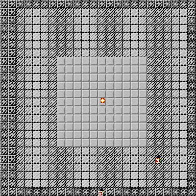
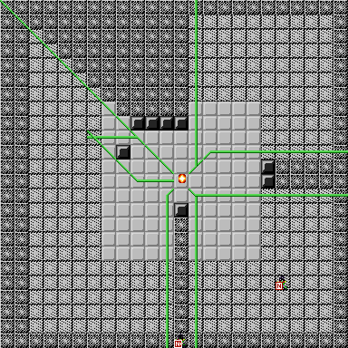

# Combat 

<!---
## Combat Fundamentals
## The Combat Map
### Distances
### Lines, Bursts, Blasts
### Line of Sight and Cover
### Light and Concealment
### Flanking

## Combat Sequence
### Escalation

## Resource Management
### At-Will, Encounter and Daily powers
### Action Points
### Damage, Incapacitation and Healing

## Actions
### Reactions

## Movement

## Attacking
### Range and Targeting
### Hit Roll
### Hit Modifiers
#### Critical Hits
### Damage Roll
#### Miss Damage
### Combat Conditions
### Forced Movement

## Combat Maneuvers
###Standard Maneuvers
###Improvised Maneuvers
-->
In this chapter we provide the rules for resolving a combat encounter.

##Combat Fundamentals

In Square Fireballs, a combat encounter represents a short, violent conflict between an adventuring party of Player Characters and a group of Monsters controlled by the Game Master. 

<div class="tip">**Tip**:Note that we use **Monsters** as shorthand for "bad guys", and it is perfectly possible to have a Monster team composed of non-monstruous mundane characters like human bandits or wolves. Or they can also be, you know, many-eyed tentacled abominations.</div>

In combat, each character (whether a Player Character or a Monster) takes **turns** to carry out **actions** such as moving, attacking enemies, or healing or assisting allies. Some actions succeed automatically, whereas others require the character to make a successful die roll. For example, movement through normal terrain is resolved automatically, with the player stating the character's movement path and changing the character's position accordingly. On the other hand, attacking requires the character to roll against the enemy's defense to determine if the attack hits, and then rolling again to determine the damage dealt by the attack.

<div class="tip">**Tip**: Generally, to make a die roll in the game a player rolls a 20-sided die (aka. d20), adds the appropriate bonus from their Character Sheet, plus any modifiers that apply, and tries to beat a target number, like a Check Difficulty or an enemy defense stat. Another common type of die roll is the damage roll, which is made after hitting with an attack. In a damage roll, the player rolls several dice of a type determined by the attack, adds a damage bonus and uses the total as the amount of inflicted damage.</div>

The goal of a combat encounter is incapacitate all enemy characters, typically by inflicting enough damage to reduce them below 0 Hit Points. A combat can also end when either the monsters or the Player Characters decide to flee.


## The Combat Map


### Distances

The following figure illustrates how distances work. The number in each square represent the distance between the Wizard and that square.


This figure shows some specific examples of squares that are 1,2,3,4, and 5 units away from the Wizard


### Lines

Due to the way that distances are defined in our maps, certain geometrical elements like lines are not as straightforward as one would expect. In the game map, a Line is:

- one of the shortest paths between two points (note that there can be several paths that meet this requirement!)
- composed of up to two straight segments: one in the horizontal or vertical direction, and another in a diagonal direction. 

For any two points in the map, there will be one or two Lines that meet this definition.

This figure shows the simplest types of lines, composed of a single horizontal (1), vertical (2) or diagonal (3, 4) segment. Note that when two points can be joined by a single-segment Line, there will only be a single Line between these points.


This figure shows examples of two-segment lines. When two points can be joined by a two-segment line, there will always be two such lines between these points.


### Close and Area powers: Burst, Blast, Line

Area Burst


Range of Area Burst powers


Close Burst


TODO: Blast
TODO: Line


### Line of Sight and Cover

Basic cover


Basic cover examples with attacking characters


Cover for large creatures


Examples of cover for large creatures with attacking characters


Basic Line of Sight


Examples of Line of Sight with enemy characters


Examples of Line of Sight with walls and doors


Combining Line of Sight, Cover, Superior Cover


### Light and Concealment

Light



more light



Yet more light


### Flanking

Flanking basics


Flanking for large creatures


## Combat Sequence
### Escalation

## Resource Management
### At-Will, Encounter and Daily powers
### Action Points
### Damage, Incapacitation and Healing

## Actions
### Reactions

## Movement

## Attacking
### Range and Targeting
### Hit Roll
#### Hit Modifiers

Condition | Modifier
------------- | -------------
Defender grants Advantage to Attacker | +2
Defender has any Cover from Attacker | -2
Defender has Superior Cover from Attacker | -3
Defender has any Concealment from Attacker | -2
Defender has Superior Concealment from Attacker | -3
Attacker is Hindered | -2
Attack with Recharge weapon, unless Recharged | -2
Ranged attack at Long Range | -2
Opportunity Attack | + Reaction Modifier

#### Critical Hits
### Damage Roll
#### Miss Damage
### Combat Conditions
#### List of Combat Conditions

List of combat conditions

- Blinded
    - Grants Advantage _(+2 to be hit)_
    - Cannot Flank
    - Treats other characters or objects as having Superior Concealment _(-5 to hit them)_.
    - No line of sight to other characters or objects
    - +1 Difficulty Category to Perception Skill Checks.

- Dazed
    - Cannot Flank
    - Cannot use Opportunity or Immediate Actions
    - Each turn, can use only:
        - One Minor Action, and
        - Either one Standard Action or one Move Action
        
- Dazzled
    - Treats all enemies as having Concealment _(-2 to hit them)_ or, if already in Concealment, as having Superior Concealment _(an additional -3 to hit them)_.


- Deafened
    - Grants Advantage  _(+2 to be hit)_
    - When using the Search combat maneuver, roll a Save. On a failed save, the maneuver has no effect
    - +1 Difficulty Category to Perception Skill Checks


- Dominated
    - Cannot take actions
    - When damaged, can roll a Save to end this condition
    - The dominating character can spend a move action to make the dominated character move its speed. _(This counts as forced movement)_
    - The dominating character can spend a standard action to make the dominated character use an at-will attack. _(This counts as a forced attack)_

<div class="tip">
Sidebar: Forced attack

Certain powers or effects allow one character to force an enemy to make an attack. Such attacks are considered forced attacks, and use the following rules:

If there are different attack powers that meet the requirement for the forced attack (e.g. basic attacks or at-will attacks), the character forcing the attack is aware of all available options and can choose any of them.

For the chosen attack power, the character forcing the attack can make any relevant decision, including (but not limited to) targets, area of effect, forced movement caused by the attack.

A character forced to make an attack cannot target himself with the forced attack.

Forced attacks ignore the marked condition. A character making a forced attack counts as not marked, for the purposes of that attack.

Forced attacks never trigger opportunity attacks.
</div>

- Grabbed
    - Cannot move
    - When grabbed, the character is pulled to a square adjacent to the grabbing character
    - The condition ends if at any time the grabbed character is not adjacent to the grabbing character
    - Grabbed character can use the Escape combat maneuver to end the condition. _(Move Action, roll save to end grab from one enemy)_
    - If forced movement would cause the grabbed character and the grabbing character to no longer be adjacent, the grabbed can roll a Save to end this condition. If the condition doesn't end this way, the forced movement is negated
    - A character may be Grabbed by multiple enemies at a time.

- Helpless

    - Grants Advantage _(+2 to be hit)_
    - Melee Attacks against the character gain +10 Crit Range
    
    
- Hindered

    - -2 to Hit
    
<div class="tip">
Tip: Many types of action can cause a character to be Hindered for a turn. These include combat maneuvers like Shift, Charge, Stand Up, Quick Draw, 
</div>

- Immobilized
    - Cannot move

- Marked
    - -2 Hit on attacks that violate the mark (see sidebar)
    - A character may be Marked by multiple enemies at a time.

<div class="tip">
Sidebar: Violating marks

An attack by a Marked character violates a mark if it targets an enemy not marking the character. The following exceptions apply:

- If the attack targets multiple characters, and all enemies marking the character are already targeted, any additional targets do not violate the mark.
- If multiple attacks are made in sequence as part of the same attack power _(e.g. primary and secondary attacks)_, once all enemies marking the character have been targeted at least once, any additional targets do not violate the mark.
- If an attack originally does not violate the mark, and the attack targets are somehow changed by an enemy action or other effect, this does not cause the attack to violate the mark. 
- If an attack originally does not violate the mark, and the attacker becomes Marked during the attack _(e.g. by an enemy reaction)_, this does not cause the attack to violate the mark. 
</div>

<div class="compatibility">**Compatibility Note**: Defender Aura

Some characters in compatible books have the Defender Aura power. The effect of this power should be replaced with the following:

“Enemies in the aura are Marked by you.”
</div>

<div class="compatibility">**Compatibility Note**: Violating Marks

Any reference from compatible books to effects that trigger when a Marked character 'makes an attack that does not include the marking character as a target' should use the rules for violating marks described above.
</div>


- Petrified
    - Grants Advantage
    - Cannot take actions
    - Gains Resist.

- Prone
    - Condition lasts indefinitely until the character stands up _(e.g. by using the Stand Up combat maneuver: Move Action, end the prone condition, move 1, and become Hindered this turn)_
    - Cannot make any movement other than crawling _(e.g. by having a Crawl Speed, or by using the Crawl combat maneuver: Move Action, crawl 1)_
    - Hindered _(-2 Hit)_
    - Grants Advantage against melee attacks _(+2 to be hit)_
    - Against non-melee attacks, gains Cover _(-2 cover penalty to attack rolls)_ or, if already in Cover, gains Total Cover _(an additional -3 cover penalty to attack rolls)_


- Exiled 
    - When exiled, a character disappears from its current position. When the condition ends, the character reappears on this position or, if not possible, in the closest ground square of his choice, unless the exiling effect states otherwise.
    - Does not occupy a space.
    - No line of sight to and from other creatures or objects unless the exiling effect states otherwise.
    - No line of effect to and from other creatures or objects unless the exiling effect states otherwise.

- Restrained
    - Cannot move
    - Ignores forced movement 
    - Grants Advantage _(+2 to be hit)_
    - Hindered _(-2 Hit)_

- Slowed
    - For each square moved, must spend an additional square of movement

- Stunned
    - Cannot attack
    - Cannot move
    - Can only take one action per turn
    - Cannot use Reactions
    - Grants Advantage _(+2 to be hit)_

- Swallowed
    - When swallowed, a character disappears from its current position. When the condition ends, the character reappears in a square of his choice as close as possible to the swallower.
    - Can spend a move action to make an Escape Check (see sidebar). If successful, condition ends.
    - Does not occupy a space.
    - Can only take one action per turn.
    - Only has line of effect and line of sight to and from the swallower, and other characters and objects swallowed by it.
    - The inside of the swallower, and swallowed characters and objects, are in total darkness unless otherwise specified. Swallowed characters can use any light source to illuminate the inside of the swallower and all characters and objects swallowed by it.
    - When using a burst or blast power while swallowed, the swallower and all characters and objects swallowed by it are included in the burst or blast.

- Unconscious
    - When a character falls unconscious, he is knocked prone.
    - When damaged, if the character has 1 or more remaining hit points after receiving the damage, the condition ends.
    - Helpless _(+2 to be hit, enemy melee attacks gain +10 Crit Range)_
    - Cannot take actions
    - Cannot see.

- Weakened
    - Damage dealt is halved
    - Healing granted or received is halved 
    - Shield Points granted or received are halved


### Forced Movement{.newPage}

#### Push

Push a single unit


Push a single unit, showing Lines


Push multiple units


Push multiple units, showing Lines for path


Push single unit at range, showing Lines


Push multiple units at range, showing Lines


#### Pull

Pull at range


#### Slide

Slide a single unit, at range (1) and in melee (2)


Slide multiple units, at range (1) and in melee (2)


## Combat Maneuvers

```{r, echo=FALSE, results='asis', message=FALSE, warning=FALSE, prompt=FALSE}
basedir <- here::here()
source(file.path(basedir,"scripts","1-01-Maneuver-csv-to-html.R"))

cat(toHtmlManeuverList(getManeuverList(basedir)))
```

###Standard Maneuvers
###Improvised Maneuvers
